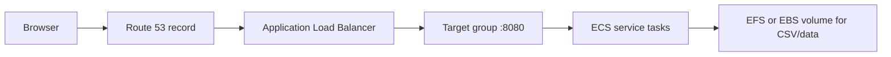

# Roadmap Render Project

Edit a release roadmap in the browser (Agile board by domain), save draft CSV, publish to live, export Excel, and render legacy `roadmap.xlsx` / `roadmap.drawio` via `render.py`.

## Dependencies

### Python (API + Excel export)

From the project root:

```powershell
pip install -r requirements.txt
```

| Package | Purpose |
|---------|---------|
| `pandas` | CSV / roadmap data |
| `openpyxl` | Excel export |
| `fastapi` | Admin API |
| `uvicorn` | ASGI server |
| `pydantic` | Request models |

**Requires:** Python 3.10+ recommended (3.8+ for `render.py` alone).

### Node.js (React admin UI)

Only needed to build or develop the UI:

```powershell
cd web/frontend
npm install
npm run build    # output → web/static/dist
```

| Tool | Purpose |
|------|---------|
| Node.js 20+ | Build toolchain |
| Vite 6 | Bundler |
| React 19 | Admin UI |
| Tailwind CSS 4 | Styling |

**Quick start (Windows):** `.\start-admin.ps1` — installs UI deps if needed, builds, sets `ROADMAP_ADMIN_TOKEN=dev-admin`, starts uvicorn on port 8080.

Open: `http://127.0.0.1:8080/?token=dev-admin`

**Work machine / corporate firewall:** see **[docs/WORK-SETUP.md](docs/WORK-SETUP.md)** (git pull in Cursor, pip/npm proxy, pre-built UI).

## Data files

| File | Role |
|------|------|
| `roadmap.csv` | Published (live) tasks |
| `roadmap.draft.csv` | Admin working copy |
| `domains.json` / `domains.draft.json` | Per-domain “current state” text |
| `releases.csv` | Release windows (R22, R23, …) |
| `history/` | Version snapshots on save/publish |

See [CSV_FORMAT.md](CSV_FORMAT.md) for column definitions (`flag` = yes/no, `flag_label` = badge text).

## Admin UI

- **Edit** — draft, add/delete tasks and domains, save, publish, version history.
- **Standard view** — live read-only (future: SSO customers).
- **Dark mode** — moon/sun in top bar.
- **Domain bar** — **See current state** expands status notes; rename domain; collapses on Done or click outside.
- **Tasks** — solid border = no flag; dashed = flag yes + custom label.

Dev UI with hot reload:

```powershell
$env:ROADMAP_ADMIN_TOKEN = "dev-admin"
python -m uvicorn web.app:app --host 127.0.0.1 --port 8080
# separate terminal:
cd web/frontend && npm run dev
```

## CLI render (Excel / draw.io)

```powershell
python render.py
```

Produces `roadmap.xlsx` and `roadmap.drawio` in the project folder.

## Push to your Git repo

From the project folder (not the parent `working` monorepo unless that is intentional):

```powershell
git status
git add roadmap.csv releases.csv render.py web/ requirements.txt README.md CSV_FORMAT.md start-admin.ps1
# Do not commit secrets, .env, or local draft unless you intend to:
# git check-ignore roadmap.draft.csv domains.draft.json
git commit -m "Roadmap admin UI: board, draft/publish, domain current state"
git remote add origin https://github.com/YOUR_ORG/YOUR_REPO.git   # once
git push -u origin main
```

Use a private repo if the roadmap contains sensitive planning data. Put `ROADMAP_ADMIN_TOKEN` only in CI/secrets or ECS task secrets, never in git.

## Run on AWS (ECS + ALB + Route 53)

High-level path (POC → production):



1. **Container image** — Dockerfile runs `uvicorn web.app:app --host 0.0.0.0 --port 8080`; bake `web/static/dist` from `npm run build` in CI or multi-stage build.
2. **Secrets** — Store `ROADMAP_ADMIN_TOKEN` in AWS Secrets Manager; inject into task definition as env var.
3. **Data** — Mount `ROADMAP_DATA_DIR` (e.g. `/data`) with EFS containing `roadmap.csv`, `releases.csv`, draft files, and `history/`. Without persistent volume, edits are lost on redeploy.
4. **ECS** — Fargate service, task CPU/memory per load, desired count ≥ 1.
5. **ALB** — Listener 443 (ACM cert), target group HTTP → container port 8080, health check `GET /health` (no auth).
6. **Route 53** — Alias A/AAAA record `roadmap.example.com` → ALB DNS name.
7. **Security** — SG: ALB ingress 443 from corp/VPN; tasks only from ALB. No public admin without SSO later.

Env vars for the task:

| Variable | Example |
|----------|---------|
| `ROADMAP_ADMIN_TOKEN` | from Secrets Manager |
| `ROADMAP_DATA_DIR` | `/data` |
| `PORT` | `8080` (if your entrypoint uses it) |

Until SSO exists, restrict ALB to internal subnets or IP allow lists.

More detail in [WEB.md](WEB.md).

## Airgapped deployment (target end state)

This app is intended to run **without internet access** in production. Critical points:

1. **Pre-build the UI** — `npm run build` → ship `web/static/dist` in the image; **Node is not required at runtime**.
2. **Bundle Python deps** — install from vendored wheels or a fully loaded container image; no live `pip install` from PyPI in the enclave.
3. **No CDN** — UI uses system fonts only (no Google Fonts). Verify with browser DevTools that no external requests occur.
4. **Persistent data** — mount `ROADMAP_DATA_DIR` (CSVs, `domains.*.json`, `history/`); backups are filesystem copies.
5. **Auth** — token or **internal-only** Dex/LDAP/F5; no public OIDC.
6. **Transfer** — `docker save` / approved media / private registry inside the enclave.

Full checklist, risks, and testing steps: **[docs/AIRGAPPED.md](docs/AIRGAPPED.md)**.

---

## Context for AI agents — Dex + F5 + LDAP SSO (planned)

Use this section when implementing authentication in front of this app. **The POC today uses `ROADMAP_ADMIN_TOKEN` (Bearer or `?token=`).** Production should replace that with OIDC and group-based roles.

### Application facts agents must know

- **Stack:** FastAPI serves static React from `web/static/dist` and JSON under `/api/*`.
- **Health:** `GET /health` — no auth (use for ALB health checks).
- **Roles to implement:**
  - `admin` — `PUT /api/roadmap`, `POST /api/publish`, `POST /api/export/excel`, version restore.
  - `viewer` — `GET /api/timeline?source=live` only (Standard view); no draft, no writes.
- **Draft vs live:** Editors use `source=draft`; viewers use `source=live` after publish.
- **Session:** Prefer HTTP-only session cookie after OIDC code flow; stop passing long-lived tokens in query strings in production.

### Target architecture (F5 + Dex + LDAP)

**Airgap note:** Dex, LDAP, and F5 must all live on **internal** networks reachable from the app. No external IdP callbacks.

1. **F5 BIG-IP** — VIP for `roadmap.example.com`, TLS termination, optional WAF, pool to ALB or directly to ECS tasks.
2. **SSO** — F5 as SAML SP or OIDC RP, or forward `Authorization` / `X-Forwarded-*` headers from an IdP integration your org already uses.
3. **Dex** — OIDC issuer bridge; connectors to **LDAP** (or AD) for user/group lookup.
4. **Group mapping (LDAP → app roles):**
   - Example: LDAP group `roadmap-admins` → app role `admin`.
   - Example: LDAP group `roadmap-viewers` or all authenticated users → `viewer`.
5. **FastAPI middleware** — Validate JWT from Dex (issuer, audience, signature); map `groups` or `preferred_username` claim to `admin` / `viewer`; return 401/403 on protected routes.

### Suggested agent tasks (checklist)

- [ ] Add OIDC middleware (e.g. `authlib` or reverse-proxy auth only) — validate JWT on `/api/*` except `/health`.
- [ ] Remove or gate `?token=` in production builds.
- [ ] Map Dex `groups` claim → `request.state.role`.
- [ ] F5: publish SAML/OIDC metadata; attach policy to VIP; persist session stickiness if needed.
- [ ] Dex: `config.yaml` static client for roadmap app; LDAP bind; `groupSearch` for admin/viewer groups.
- [ ] Document LDAP DNs and group names for the customer’s directory (do not hardcode in repo).
- [ ] ALB + ECS unchanged except env: drop `ROADMAP_ADMIN_TOKEN` when OIDC is live; optional `OIDC_ISSUER`, `OIDC_CLIENT_ID`, `OIDC_CLIENT_SECRET` from Secrets Manager.

### Dex config hints (illustrative — adjust to your LDAP)

```yaml
# dex/config.yaml fragments — NOT committed secrets
connectors:
  - type: ldap
    id: ldap
    name: LDAP
    config:
      host: ldap.example.com:636
      bindDN: cn=bind,ou=svc,dc=example,dc=com
      bindPW: ${LDAP_BIND_PASSWORD}
      userSearch:
        baseDN: ou=people,dc=example,dc=com
        filter: "(objectClass=person)"
        username: uid
        idAttr: DN
        emailAttr: mail
      groupSearch:
        baseDN: ou=groups,dc=example,dc=com
        filter: "(objectClass=groupOfNames)"
        userMatchers:
          - userAttr: DN
            groupAttr: member
        nameAttr: cn
```

Static OIDC client for the roadmap service redirect URI: `https://roadmap.example.com/oauth2/callback` (or path your middleware expects).

### F5 hints for agents

- Terminate TLS on VIP; re-encrypt to ALB if required.
- If F5 performs OIDC: configure IdP (Dex) issuer URL, client ID/secret, redirect URI matching the app.
- Pass headers to backend: `X-Forwarded-Proto`, `X-Forwarded-For`, and optionally `X-User`, `X-Groups` **only if** F5 validates the session (do not trust spoofed headers from the internet).
- Health monitor: `GET /health` every 30s on pool members.

### Security notes for agents

- Never commit LDAP bind passwords, Dex keys, or F5 passphrases.
- Published `roadmap.csv` may be visible to all authenticated viewers; draft must stay admin-only.
- CORS: same-origin when UI and API share one host (current design).

---

## Related docs

- [WEB.md](WEB.md) — API table, draft/publish workflow
- [docs/AIRGAPPED.md](docs/AIRGAPPED.md) — airgapped build, transfer, runtime, testing
- [CSV_FORMAT.md](CSV_FORMAT.md) — spreadsheet columns
- [README.txt](README.txt) — original render.py setup (text)
